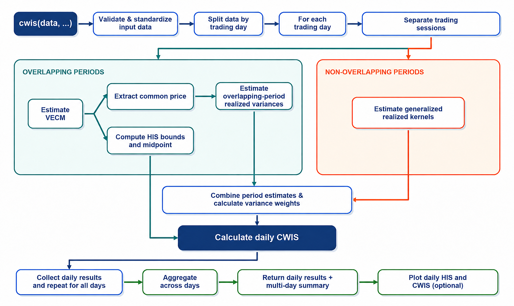

<!-- README.md is generated from README.Rmd. Please edit that file -->

# priceDiscoveRy

`priceDiscoveRy` is an R package for estimating daily
contribution-weighted information shares (CWIS) for a futures and spot market with partially overlapping trading hours.

The package converts a 24-hour price-discovery analysis into a reproducible workflow. It validates and standardizes high-frequency price data, separates each trading day into overlapping and single-market sessions, estimates price discovery during overlapping periods with a vector error-correction model (VECM), measures volatility in each period, and combines the estimates into daily and multi-day CWIS results.

This package is based on the methodology introduced by Thomas Dimpfl and Karsten Schweikert in Information Shares for Markets with Partially Overlapping Trading Hours.

## Installation

You can install the development version of priceDiscoveRy from [GitHub](https://github.com/) with:

``` r
# install.packages("pak")
pak::pak("Sophia8226/priceDiscoveRy")
```
Alternatively, install it with `remotes`:

```{r installation-remotes, eval=FALSE}
# install.packages("remotes")
remotes::install_github("Sophia8226/priceDiscoveRy")
```

## Package workflow

The following diagram summarizes the package workflow from raw input data to daily CWIS estimates and the multi-day summary.



## Method overview

For each trading day, `priceDiscoveRy` performs the following steps:

1. validates timestamps and futures/spot prices;
2. assigns observations to trading sessions using New York local time;
3. estimates a VECM during periods in which both markets overlap;
4. computes Hasbrouck information-share bounds and their midpoint for overlapping period;
5. extracts the VECM common price and calculates overlapping-period realized variances;
6. estimates generalized realized kernels in non-overlapping periods;
7. normalizes period variances into contribution weights; and combines the overlapping and non-overlapping contributions into daily CWIS estimates.

The main calculation can be summarized as

```math
\begin{pmatrix}
S_{cw,1}^{*} \\
S_{cw,2}^{*}
\end{pmatrix}
=
w_{\mathit{overlap}}
\begin{pmatrix}
S_{1}^{*} \\
S_{2}^{*}
\end{pmatrix}
+
w_{\mathit{market1}}
\begin{pmatrix}
1 \\
0
\end{pmatrix}
+
w_{\mathit{market2}}
\begin{pmatrix}
0 \\
1
\end{pmatrix}.
```

## Example

The complete workflow is available through `cwis()`:

```{r basic-usage, eval=FALSE}
library(priceDiscoveRy)

data("example_sp500_futures_spot_oneweek_24h_1sec")

fit <- cwis(
  data = example_sp500_futures_spot_oneweek_24h_1sec,
  datetime_col = "datetime",
  futures_col = "V1",
  spot_col = "V2",
  spot_multiplier = 10,
  tz = "America/New_York",
  K = 10L
)

fit
```

The returned `cwis_result` contains daily estimates, multi-day summaries,
diagnostics, variance-weight summaries, detailed daily objects, and the
settings used in the calculation:

```{r inspect-results, eval=FALSE}
fit$daily
fit$summary
fit$diagnostics
fit$variance_weights
```

The aggregate HIS and CWIS estimates can be displayed directly:

By default, an error on one trading day is recorded without stopping the
remaining days. To stop immediately when a daily calculation fails, use:

```{r stop-on-error, eval=FALSE}
fit <- cwis(
  data = example_sp500_futures_spot_oneweek_24h_1sec,
  datetime_col = "datetime",
  futures_col = "V1",
  spot_col = "V2",
  tz = "America/New_York",
  continue_on_error = FALSE
)
```

## Plotting results

`cwis_result` objects have a dedicated `plot()` 
The daily HIS and CWIS estimates can be visualized separately for the futures and spot markets. The dashed horizontal line represents the 50% benchmark.Only successful trading days are plotted.

### S&P 500 futures

```{r plot-futures-code, eval=FALSE}
plot(fit, market = "futures")
```


### S&P 500 spot

```{r plot-spot-code, eval=FALSE}
plot(fit, market = "spot")
```


Date formatting and the maximum number of horizontal-axis labels can be
customized:

```{r customize-plot, eval=FALSE}
plot(
  fit,
  market = "futures",
  date_format = "%d.%m.%Y",
  max_date_labels = 12L
)
```

## Main functions

| Function | Purpose |
|---|---|
| `cwis()` | Run the complete multi-day CWIS workflow |
| `validate_and_standardize_input()` | Validate timestamps and prices and create a standardized input table |
| `split_trading_days()` | Split standardized observations into trading days |
| `split_trading_sessions()` | Assign one day's observations to market sessions |
| `vecm()` | Estimate the overlapping-period VECM |
| `his()` | Compute Hasbrouck information shares from a fitted VECM |
| `common_price()` | Extract the VECM common price and related diagnostics |
| `realized_variance()` | Calculate realized variance from efficient-price returns |
| `realized_kernel()` | Estimate a generalized realized kernel in a single-market session |
| `combine_weights()` | Combine period variances and calculate normalized weights |
| `daily_cwis()` | Calculate CWIS for one standardized trading day |
| `aggregate_cwis()` | Aggregate successful and failed daily results |
| `plot.cwis_result()` | Plot daily HIS and CWIS for the futures or spot market |

Use the package help pages for complete argument and return-value details:

```{r help, eval=FALSE}
?cwis
?split_trading_sessions
?plot.cwis_result
```

## Default trading sessions

The default boundaries reproduce the one-second session ranges in the original analysis:


| Session object | New York time |
|---|---|
| `futures_pre` | Before 04:00:00 |
| `overlap_pre` | 04:00:00 to 09:29:59 |
| `overlap_core` | 09:30:00 to 16:00:00 |
| `overlap_post_1` | 16:00:01 to 16:59:59 |
| `spot_maintenance` | 17:00:00 to 17:59:59 |
| `overlap_post_2` | 18:00:00 to 19:59:59 |
| `futures_post` | From 20:00:00 onward |

Session membership is determined from timestamps rather than fixed row positions. The default boundaries and tests currently reproduce the intended behavior for one-second data. 

## Development status

The package is under active development, and the current automated test suite passes successfully. Results depend on the selected session boundaries, sampling frequency, VECM lag order, realized-kernel settings, and data quality.

## License

This project is licensed under the MIT License.
