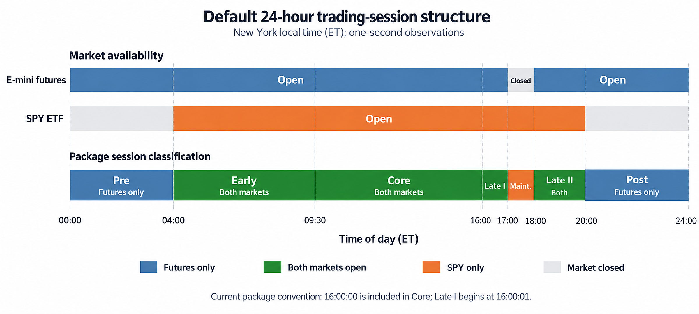
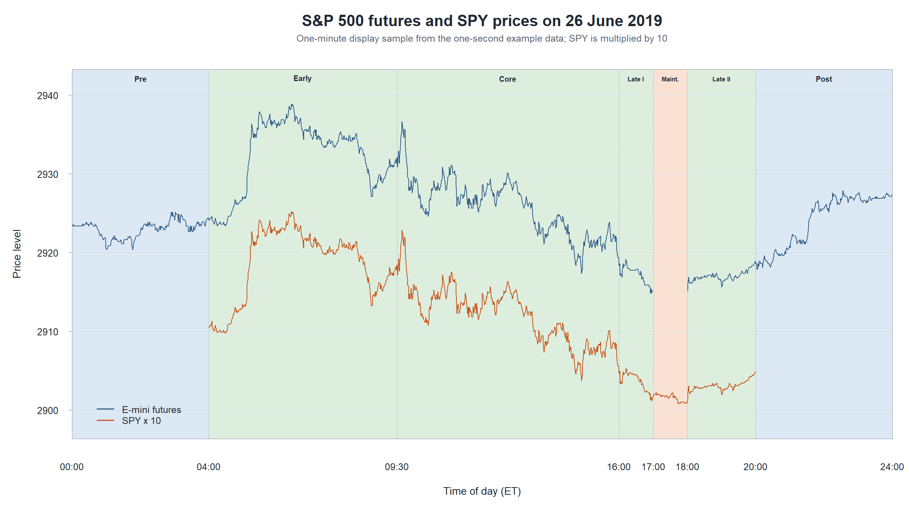
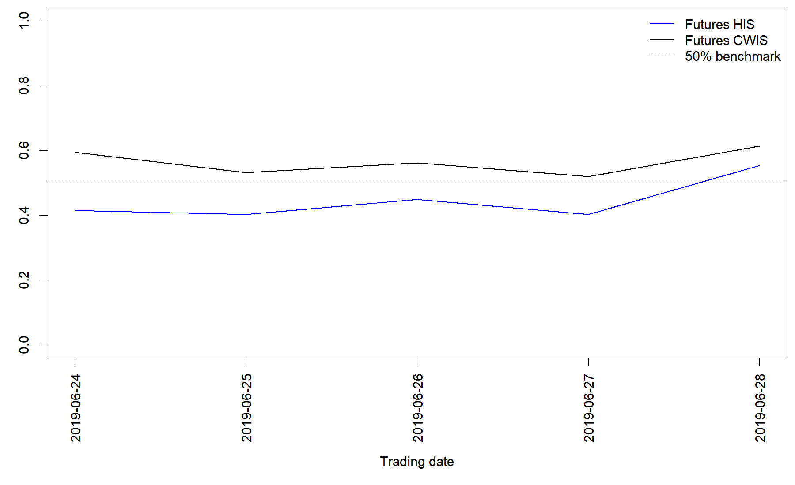
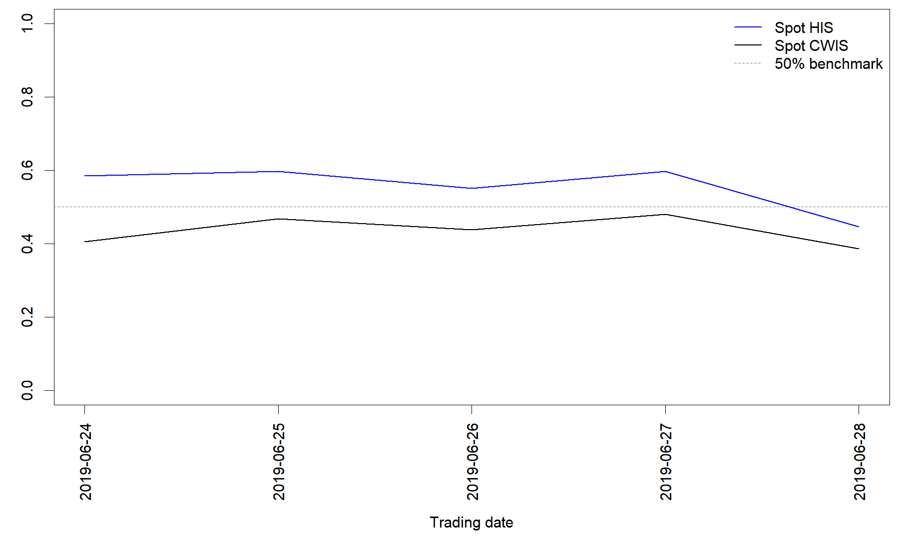

```{r, include = FALSE}
knitr::opts_chunk$set(
  collapse = TRUE,
  comment = "#>"
)
```

```{r setup}
library(priceDiscoveRy)
```

---
title: "A Week of Price Discovery: An Empirical Application"
author: "Hui Sun"
output:
  rmarkdown::html_vignette:
    toc: true
    number_sections: true
vignette: >
  %\VignetteIndexEntry{A Week of Price Discovery: An Empirical Application}
  %\VignetteEngine{knitr::rmarkdown}
  %\VignetteEncoding{UTF-8}
---

```{r setup, include=FALSE}
knitr::opts_chunk$set(
  collapse = TRUE,
  comment = "#>",
  eval = FALSE,
  fig.width = 9,
  fig.height = 5
)
```

This vignette tells the story of price discovery over one week in two linked
S&P 500 markets. The E-mini futures market is open for most of the day, while
the spot market, represented by SPY, trades for a shorter interval. For part of
the day the two markets speak at the same time; for the rest, only one of them
can respond to new information. The purpose of the exercise is to hear the
complete conversation rather than listen only when both markets are open.

The example uses the data set
`example_sp500_futures_spot_oneweek_24h_1sec` included with
`priceDiscoveRy`. The methodology, equations, and maintained assumptions are
presented in the companion methodology vignette. Here the focus is practical:
understanding the data, running the estimator, checking the result, and giving
the output an economic interpretation.

# Meet the data

## One week observed second by second

Load the package and the example data:

```{r load-data}
library(priceDiscoveRy)

data("example_sp500_futures_spot_oneweek_24h_1sec")
market_data <- example_sp500_futures_spot_oneweek_24h_1sec

class(market_data)
dim(market_data)
head(market_data)
```

The object is both a `data.table` and a `data.frame`. It contains 590,400 rows
and five variables:

| Variable | Meaning |
|:--|:--|
| `date` | Calendar date in `YYYY-MM-DD` format. |
| `time` | New York local clock time in `HH:MM:SS` format. |
| `datetime` | Combined New York local date and time. |
| `V1` | S&P 500 E-mini futures price. |
| `V2` | SPY price before application of the scaling multiplier. |

The observations run from 24 June through 30 June 2019. The first six dates
contain 86,400 one-second rows each. The final date ends at 19:59:59 and
contains 72,000 rows.

```{r data-coverage}
table(market_data$date)
range(market_data$datetime)
colSums(is.na(market_data))
```

All five columns are populated in this rectangular example data set. Market
openness is therefore determined from the known trading schedule, not inferred
from missing values. In an application to a different data source, missing
values, stale quotes, and carried-forward prices should be examined before the
package is run.

## Two price scales, one economic object

The futures contract and SPY do not use the same quoted scale. In this sample,
`V1` ranges from 2914.500 to 2961.625, whereas `V2` ranges from 290.075 to
294.575. Multiplying SPY by 10 places the series on a comparable scale:

```{r inspect-scales}
range(market_data$V1)
range(market_data$V2)
range(10 * market_data$V2)
```

The scaling does not force the two series to be identical. A futures-spot basis
can remain because of financing, dividends, and contract-specific features.
The important condition is that the two prices are economically linked and do
not drift apart without bound.

## The weekend is part of the story

A useful feature of the example is that the file contains seven calendar dates
but only five active trading days. Counting price changes by date makes this
visible:

```{r activity-by-day}
daily_activity <- do.call(
  rbind,
  lapply(split(as.data.frame(market_data), market_data$date), function(x) {
    data.frame(
      rows = nrow(x),
      futures_changes = sum(diff(x$V1) != 0),
      spot_changes = sum(diff(x$V2) != 0)
    )
  })
)

daily_activity
```

Prices change throughout Monday to Friday. On Saturday 29 June and Sunday
30 June, both series are flat. Those dates cannot identify an intraday VECM or
positive realized variation, so they should not be treated as successful
price-discovery days. They provide a realistic illustration of why
`cwis()` preserves failed-day records instead of quietly dropping them.

# Follow the markets through the day

## The default session clock

The package interprets the timestamps in New York local time and divides each
day into seven component sessions:

| Session | Clock time | Economically active market(s) |
|:--|:--|:--|
| `futures_pre` | 00:00:00 to 03:59:59 | Futures only |
| `overlap_pre` | 04:00:00 to 09:29:59 | Futures and spot |
| `overlap_core` | 09:30:00 to 16:00:00 | Futures and spot |
| `overlap_post_1` | 16:00:01 to 16:59:59 | Futures and spot |
| `spot_maintenance` | 17:00:00 to 17:59:59 | Spot only |
| `overlap_post_2` | 18:00:00 to 19:59:59 | Futures and spot |
| `futures_post` | 20:00:00 to 23:59:59 | Futures only |

```{r trading-session-figure, echo=FALSE, eval=TRUE, out.width='100%', fig.cap='Default market availability and package session classification.'}

```

The schedule changes who is able to incorporate information. Before 04:00 and
after 20:00, only futures can respond. From 17:00 to 18:00, futures pauses for
maintenance and the spot market stands alone. During the remaining periods,
the markets jointly reveal the efficient price.

The session split can be checked directly before estimation:

```{r inspect-sessions}
standardized <- validate_and_standardize_input(
  data = market_data,
  datetime_col = "datetime",
  futures_col = "V1",
  spot_col = "V2",
  spot_multiplier = 10,
  tz = "America/New_York"
)

days <- split_trading_days(standardized)
sessions <- split_trading_sessions(days[["2019-06-26"]])

vapply(sessions, nrow, integer(1L))
```

This check is more than housekeeping. If the time zone is wrong, observations
will be assigned to the wrong market regime and every subsequent estimate will
answer a different economic question.

## A closer look at Wednesday

The following figure shows 26 June 2019, sampled at one-minute intervals for
display. SPY is multiplied by 10 so that both paths can be viewed on a common
scale.

```{r price-path-figure, echo=FALSE, eval=TRUE, out.width='100%', fig.cap='S&P 500 E-mini futures and scaled SPY prices on 26 June 2019.'}

```

The two paths move together, but not perfectly. Their short-run differences are
exactly what the VECM is designed to describe during overlap. The shaded
sessions also show why an overlap-only analysis is incomplete: meaningful
futures price movement occurs before 04:00 and after 20:00, when SPY cannot
contribute to contemporaneous price discovery.

# Estimate the week

The complete application requires one call to `cwis()`:

```{r estimate}
fit <- cwis(
  data = market_data,
  datetime_col = "datetime",
  futures_col = "V1",
  spot_col = "V2",
  spot_multiplier = 10,
  tz = "America/New_York",
  K = 10L,
  kernel_type = "ModifiedTukeyHanning",
  bandwidth_constant = NULL,
  align_by = "seconds",
  align_period = 1L,
  continue_on_error = TRUE
)

fit
```

Behind this call, the package processes every date separately. It estimates
the overlapping-period VECM in both price orderings, forms the Hasbrouck bounds
and midpoint, extracts the common price, estimates overlapping realized
variance and single-market realized kernels, normalizes the session weights,
and finally constructs daily CWIS.

The example contains almost 600,000 one-second rows, so this calculation can
take time. For that reason the estimation chunks in this vignette are displayed
but are not evaluated during a routine vignette build. Run them interactively
when reproducing the application.

# Read the daily record before the headline result

The first result to inspect is not the mean information share. It is the daily
status table:

```{r inspect-daily}
fit$daily[, c(
  "date",
  "status",
  "error",
  "his_futures",
  "his_spot",
  "cwis_futures",
  "cwis_spot",
  "overlapping_weight"
)]
```

The five active weekdays supply usable estimates. The flat weekend dates are
retained as failures, which explains why they do not appear in the plots below.
This is preferable to deleting them silently: a reader can distinguish a known
market closure from a failure caused by poor data or a misspecified model.

The accompanying diagnostics show how many days succeeded and summarize the
overlap weight and residual correlation:

```{r inspect-summaries}
fit$diagnostics
fit$summary
fit$variance_weights
```

# The central comparison: HIS versus CWIS

## The futures market

The blue line below is the conventional Hasbrouck information-share midpoint,
which uses only simultaneous trading. The black line is futures CWIS, which
also credits information incorporated during futures-only trading.

```{r futures-result-figure, echo=FALSE, eval=TRUE, out.width='100%', fig.cap='Daily futures HIS midpoint and full-day CWIS for successful dates.'}

```

The contrast changes the story. During the first four weekdays, the
overlapping-period HIS places futures below 50%, suggesting that spot leads
while both markets are open. Once futures-only periods are included, futures
CWIS lies above 50% on every successful day. The conclusion is not that the
VECM suddenly assigns more overlapping leadership to futures. Rather, futures
earns additional contribution because it is the only active market during
informative parts of the 24-hour day.

Across the displayed week, futures HIS is roughly 0.40 to 0.55, while futures
CWIS is roughly 0.52 to 0.61. The gap between the two is the empirical reason
for using a full-day contribution-weighted measure.

## The spot market

Because this is a two-market system, the spot shares provide the complementary
view:

```{r spot-result-figure, echo=FALSE, eval=TRUE, out.width='100%', fig.cap='Daily spot HIS midpoint and full-day CWIS for successful dates.'}

```

Spot often receives more than half of the information share during overlap,
but its full-day CWIS is lower because its exclusive trading interval is only
the one-hour futures maintenance period. In contrast, futures has long
exclusive windows before 04:00 and after 20:00. CWIS therefore distinguishes
leadership during joint trading from contribution over the complete day.

# Open one daily result

The weekly plot is the ending of the story, not the evidence behind it. A
careful analysis opens at least one successful daily object and examines its
components:

```{r inspect-one-day}
successful <- which(vapply(
  fit$details,
  inherits,
  logical(1L),
  "cwis_day_result"
))

day_result <- fit$details[[successful[[1L]]]]

day_result$date
day_result$his_lower
day_result$his_upper
day_result$his_midpoint
day_result$realized_variance
day_result$variance_weights
day_result$overlapping_weight
day_result$cwis
```

The lower and upper bounds reveal how sensitive HIS is to the ordering of
contemporaneously correlated innovations. The variance weights show which
parts of the day move the efficient price. Together, they explain the daily
CWIS rather than leaving it as a black-box number.

Three identities provide quick implementation checks:

```{r numerical-identities}
stopifnot(
  isTRUE(all.equal(sum(day_result$his_midpoint), 1)),
  isTRUE(all.equal(sum(day_result$variance_weights), 1)),
  isTRUE(all.equal(sum(day_result$cwis), 1))
)
```

# Ask whether the result is trustworthy

Every empirical result needs a diagnostic chapter. The package retains
residual correlation, zero-return fractions, and observation counts for each
successful date:

```{r diagnostics}
fit$daily[, c(
  "date",
  "status",
  "residual_correlation",
  "zero_return_futures",
  "zero_return_spot",
  "n_observations",
  "n_overlap"
)]
```

These quantities answer different questions:

- High absolute residual correlation usually accompanies wider Hasbrouck
  bounds and greater ordering uncertainty.
- A high zero-return fraction may indicate stale prices, low activity, or a
  sampling grid finer than the market supports.
- Unexpected observation counts can reveal an incorrect time zone, early
  close, outage, or incomplete trading day.
- A failed date may be economically expected, as on the weekend in this
  sample, or may identify a data problem that requires investigation.

None of these diagnostics is an automatic rejection rule. They make the
judgment visible and reproducible.

# Robustness: retell the story under other choices

The displayed result uses one-second alignment, a standard Johansen VECM with
`K = 10`, and the modified Tukey-Hanning kernel. An empirical application
should ask whether the conclusion survives reasonable alternatives.

For example, the single-market series can be aligned to one-minute intervals:

```{r one-minute-robustness}
fit_one_minute <- cwis(
  data = market_data,
  datetime_col = "datetime",
  futures_col = "V1",
  spot_col = "V2",
  spot_multiplier = 10,
  tz = "America/New_York",
  K = 10L,
  kernel_type = "ModifiedTukeyHanning",
  align_by = "minutes",
  align_period = 1L
)

fit_one_minute$summary
fit_one_minute$variance_weights
```

Other useful checks include alternative VECM lag orders, plausible kernel
bandwidths, and market-specific session definitions. The target is not to find
one setting that produces a preferred ranking, but to learn whether the
economic conclusion is stable.

# A compact reproducible workflow

The complete application can be reduced to the following sequence:

```{r compact-workflow}
library(priceDiscoveRy)
data("example_sp500_futures_spot_oneweek_24h_1sec")

fit <- cwis(
  data = example_sp500_futures_spot_oneweek_24h_1sec,
  datetime_col = "datetime",
  futures_col = "V1",
  spot_col = "V2",
  spot_multiplier = 10,
  tz = "America/New_York",
  K = 10L,
  continue_on_error = TRUE
)

# Audit the sample before interpreting averages.
fit$daily[, c("date", "status", "error")]

# Inspect the main estimates and their period weights.
fit$summary
fit$variance_weights
fit$diagnostics

# Compare overlap-only and full-day price discovery.
plot(fit, market = "futures")
plot(fit, market = "spot")
```

The main empirical lesson is simple. During overlapping hours, SPY often looks
like the leading market in this week. Across the complete 24-hour day, the
futures market contributes more because it continues incorporating information
while the spot market is closed. `priceDiscoveRy` makes that change in
perspective measurable, while keeping the daily failures, weights, and
diagnostics needed to explain it.

# Further reading

For the latent efficient-price model, VECM common-trend representation,
Hasbrouck bounds, realized-variance estimators, session weights, assumptions,
and CWIS equation, see:

```{r open-methodology}
vignette("vignettes_methodology", package = "priceDiscoveRy")
```

The empirical framework follows Dimpfl, T., and Schweikert, K. (2023),
"Information shares for markets with partially overlapping trading hours,"
*Journal of Banking & Finance*, 154, 106970.
<https://doi.org/10.1016/j.jbankfin.2023.106970>.

